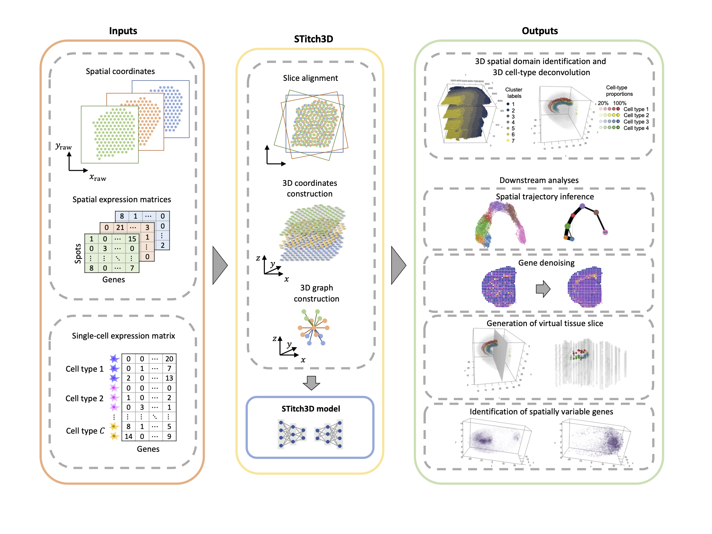
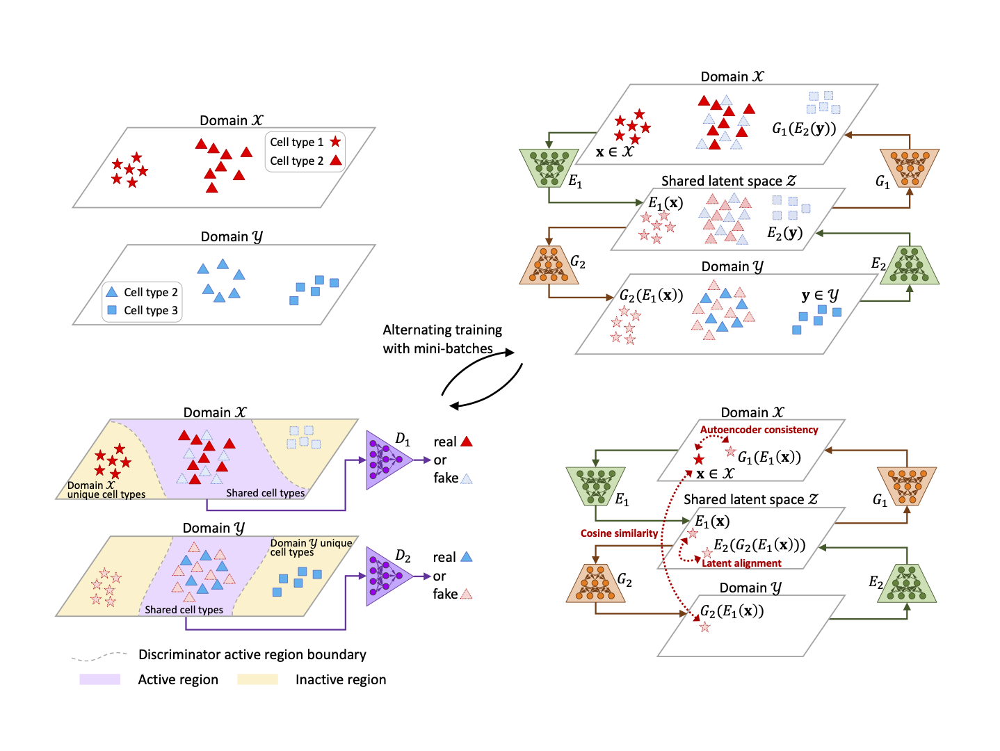
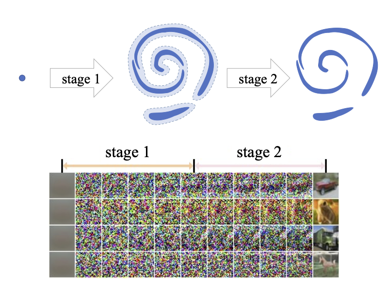

I am currently a postdoctoral associate in the Department of Biostatistics at Yale University, advised by [Prof. Hongyu Zhao](https://zhaocenter.org/index.html). I completed my Ph.D. at the Hong Kong University of Science and Technology in 2023, under the supervision of [Prof. Can Yang](https://sites.google.com/site/eeyangc/) and [Prof. Yang Wang](https://www.presidentsoffice.hku.hk/leadership/professor-yang-wang).

My research interests focus on the development of machine learning and AI methodologies, with applications in computational biology and biomedical data science.

Selected Publications
------
\* Joint first authors. # Corresponding authors. † Consortium membership.

  
  
  

    <strong>scMODAL: A general deep learning framework for comprehensive single-cell multi-omics data alignment with feature links</strong>   
    <strong>Gefei Wang</strong>, Jia Zhao, Yingxin Lin, Tianyu Liu, Yize Zhao, Hongyu Zhao#.  
    <strong>Nature Communications</strong>. 2025.  
    <a href="https://www.nature.com/articles/s41467-025-60333-z">Paper</a> |
    <a href="https://doi.org/10.1101/2024.10.01.616142">bioRxiv</a> |
    <a href="https://github.com/gefeiwang/scMODAL">Software</a> |
    <a href="https://scmodal-tutorial.readthedocs.io/en/latest/index.html">Website</a>
  

  
  
  

    <strong>Construction of a 3D whole organism spatial atlas by joint modelling of multiple slices with deep neural networks</strong>   
    <strong>Gefei Wang</strong>*, Jia Zhao*, Yan Yan, Yang Wang, Angela Ruohao Wu#, Can Yang#.  
    <strong>Nature Machine Intelligence</strong>. 2023.  
    <a href="https://www.nature.com/articles/s42256-023-00734-1">Paper</a> |
    <a href="https://doi.org/10.1101/2023.02.02.526814">bioRxiv</a> |
    <a href="https://github.com/YangLabHKUST/STitch3D">Software</a> |
    <a href="https://stitch3d-tutorial.readthedocs.io/en/latest/index.html">Website</a>
  

  
  
  

    <strong>Adversarial domain translation networks for integrating large-scale atlas-level single-cell datasets</strong>   
    Jia Zhao*, <strong>Gefei Wang</strong>*, Jingsi Ming, Zhixiang Lin, Yang Wang, <strong>The Tabula Microcebus Consortium</strong>†, Angela Ruohao Wu#, Can Yang#.  
    <strong>Nature Computational Science</strong>. 2022.  
    <a href="https://www.nature.com/articles/s43588-022-00251-y">Paper</a> |
    <a href="https://doi.org/10.1101/2021.11.16.468892">bioRxiv</a> |
    <a href="https://github.com/YangLabHKUST/Portal">Software</a> |
    <a href="https://communities.springernature.com/posts/adversarial-domain-translation-networks-for-integrating-large-scale-atlas-level-single-cell-datasets">Blog</a>
  

  
  
  

    <strong>Deep generative learning via Schrödinger bridge</strong>   
    <strong>Gefei Wang</strong>*, Yuling Jiao#, Qian Xu, Yang Wang, Can Yang#.  
    <strong>International Conference on Machine Learning</strong>. 2021.  
    <a href="https://proceedings.mlr.press/v139/wang21l.html">Paper</a> |
    <a href="https://github.com/YangLabHKUST/DGLSB">Code</a>
  

Contact
------
- Email: gefei.wang@yale.edu
- Address: 300 George Street, New Haven, CT 06511

